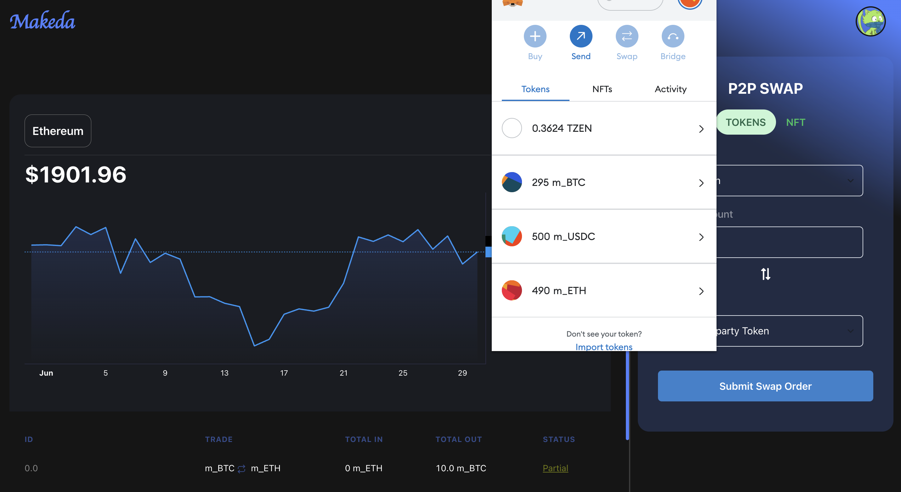
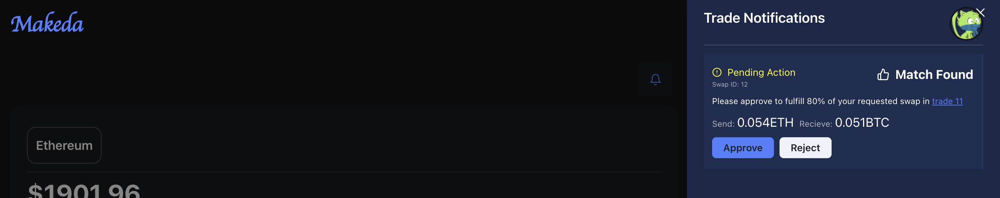
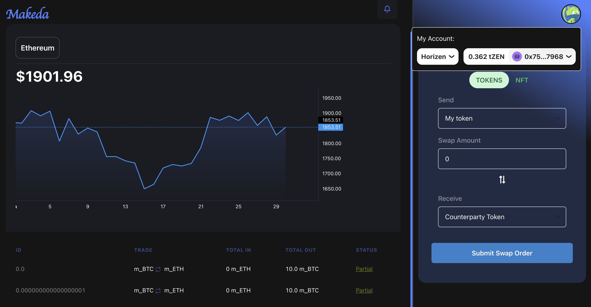

# Makeda

👉 [Video Demo]()

## Description

Peer-2-Peer Trading Platform automated using **ATE** (Adaptive Trade Execution) algorithm for seamless token swaps ( ERC20, ERC721).

## Features

- Peer-to-peer token swaps
- Scalable and Flexoble trade matching algorithm
- Trade ERC20 and ERC721 tokens
- Customizable token swaps

## Usage

1. Connect your Ethereum wallet (e.g., MetaMask) to the Makeda DEX.
2. Select the tokens you want to trade, amounts, and desired counterparty token.
3. Confirm the trade and approve the transaction.
4. Approve matches and wait for swap completion.
5. View exchange rate chart and your trade history.

## Requirements

HardHat and Nodejs Installed

```bash

git clone "https://github,com/acgodson/makeda"
cd Smart-Contract
npm install
```

Test Contract

```bash
npx hardhat test
```

<!-- Replace the image URLs below with the actual links to your project screenshots -->


## Smart Contract

The Solidity smart contract allows users to ``submit trade order``s, ``perform swaps``, and ``cancel swaps``. It also includes some helper functions for the ``ATE matching`` and ``exchange rate calculation``.

The ``TradeHelper`` contract provides helper functions for trade matching and exchange rate calculation. The`` SwapERC2``0 contract provides functions for initiating and completing swaps.

Summary of the main functions:

- **submitTradeOrder**: Allows a user to submit a trade order. It transfers the trader's tokens to the escrow contract, calculates the counterparty amount based on the exchange rate, creates a new trade, and finds the best match for the trade. It then performs the trade matching and updates the trade states and balances.

- **getPendingSwaps**: Returns an array of pending swaps for a given user.

- **completeSwap**: Allows the counterparty of a swap to complete the swap. It marks the swap as completed, updates the trade states, and records the fulfillments.

- **cancelSwap**: Allows the initiator or counterparty of a swap to cancel the swap. It transfers the tokens back to the respective parties, updates the trade balances, and deletes the swap.

- **updateExchangeRate**: Allows the owner of the contract to update the exchange rate between two tokens.

In Summary, the Makeda Trade Contract provides a basic framework for submitting  P2P trade orders and performing swaps between tokens, and can be modified to fit different use cases such *DEX, aunction platorms etc*

| Contract      | Standard | Address                                    |
| ------------- | -------- | ------------------------------------------ |
| m_USDC        | ERC20    | 0x6DA84c226162aBf933c18b5Ca6bC3577584bee86 |
| m_BTC         | ERC20    | 0x37bEcc8ed3EaFB5b8db58EDb4ee11494181a0276 |
| m_ETH         | ERC20    | 0xcC8A7e1C88596Cf4e7073343100a4A1fD0eaC8C4 |
| m_NFT         | ERC721   | 0x4ce12d9a1C69B32C69f79Fa94A5700308D5F6782 |
| TradeContract | Custom   | 0x1f27FD5DA3c691f3410301e10530757b4eeD95dF |

## More Screenshots

Clientside development



