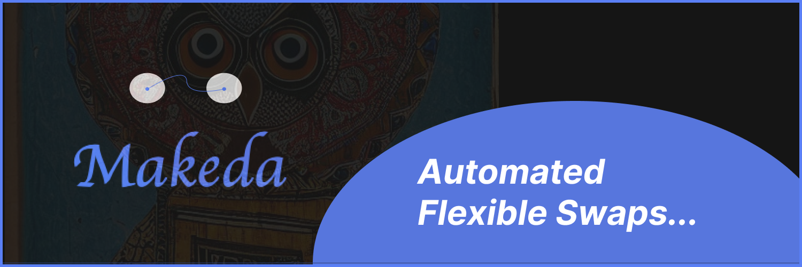

# Makeda

👉 [Video Demo]()

## Description

Peer-2-Peer Trading Platform automated using **ATE** (Adaptive Trade Execution) algorithm for seamless token swaps ( ERC20, ERC721).

## Features

- Peer-to-peer token swaps
- Scalable and Flexoble trade matching algorithm
- Trade ERC20 and ERC721 tokens
- Customizable token swaps

## Usage

1. Connect your Ethereum wallet (e.g., MetaMask) to the Makeda DEX.
2. Select the tokens you want to trade, amounts, and desired counterparty token.
3. Confirm the trade and approve the transaction.
4. Approve matches and wait for swap completion.
5. View exchange rate chart and your trade history.

## Screenshots

<!-- Replace the image URLs below with the actual links to your project screenshots -->

## Addresses

| Contract      | Standard | Address                                    |
| ------------- | -------- | ------------------------------------------ |
| m_USDC        | ERC20    | 0x6DA84c226162aBf933c18b5Ca6bC3577584bee86 |
| m_BTC         | ERC20    | 0x37bEcc8ed3EaFB5b8db58EDb4ee11494181a0276 |
| m_ETH         | ERC20    | 0xcC8A7e1C88596Cf4e7073343100a4A1fD0eaC8C4 |
| m_NFT         | ERC721   | 0x4ce12d9a1C69B32C69f79Fa94A5700308D5F6782 |
| SwapERC20     | Custom   | 0xDFE38148EF1115F2f8889A239dEEe1DC781562e1 |
| SwapERC721    | Custom   | 0x0563E89b08953C6eC9A494b6B0acf572A9B76430 |
| TradeContract | Custom   | 0x04bB38a35eAc3b7FA724b6Dde1638EC2D682Ed7F |
